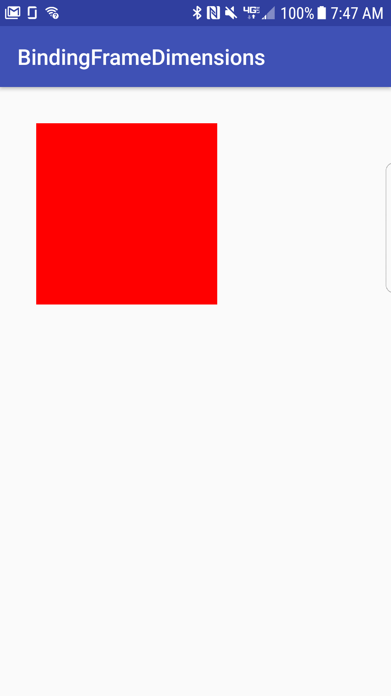

# SimpleDatabindingExample

Basic databinding example demonstrates binding a FrameLayout's dimension, position and color to a data class.

# Highlights

build.gradle
'''
apply plugin: 'kotlin-kapt'
'''

'''
android {

    dataBinding {
        enabled = true
    }

    kapt {
        generateStubs = true
    }
}
'''

# Layout declarations
'''
<layout xmlns:android="http://schemas.android.com/apk/res/android">
    <data>
        <import type="com.example.bindingframedimensions.bindingframedimensions.BindingKt"/>
        <variable
            name="panel"
            type="com.example.bindingframedimensions.bindingframedimensions.ContainerViewModel"/>
    </data>

    <FrameLayout/>
</layout>
'''

# BindingAdapter declarations

Binding.kt
'''
@BindingAdapter("android:layout_width")
fun setLayoutWidth(view: View, width: Int) {
    val layoutParams = view.layoutParams
    layoutParams.width = width
    view.layoutParams = layoutParams
}

@BindingAdapter("android:layout_height")
fun setLayoutHeight(view: View, height: Int) {
    val layoutParams = view.layoutParams
    layoutParams.height = height
    view.layoutParams = layoutParams
'''

